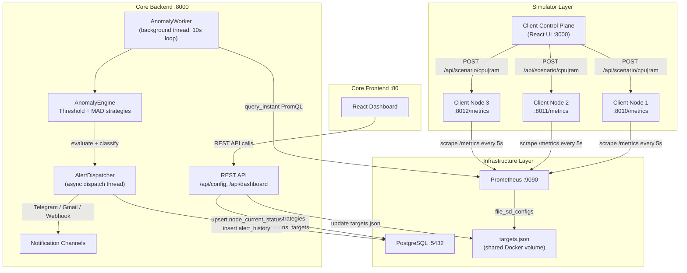
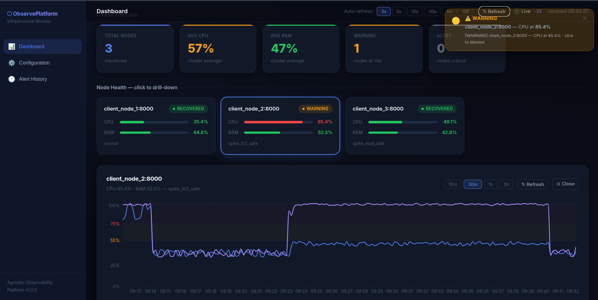
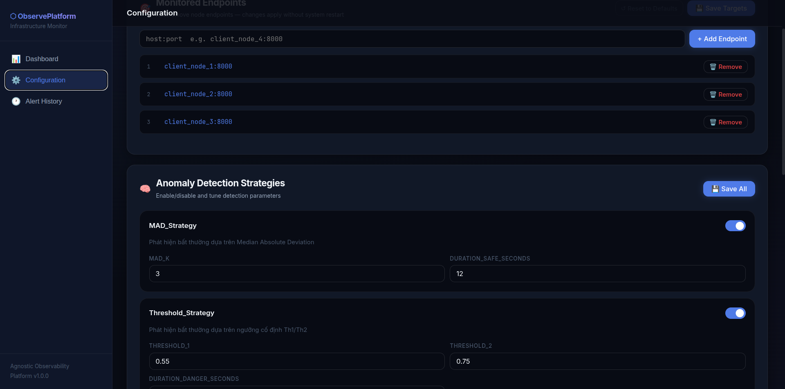
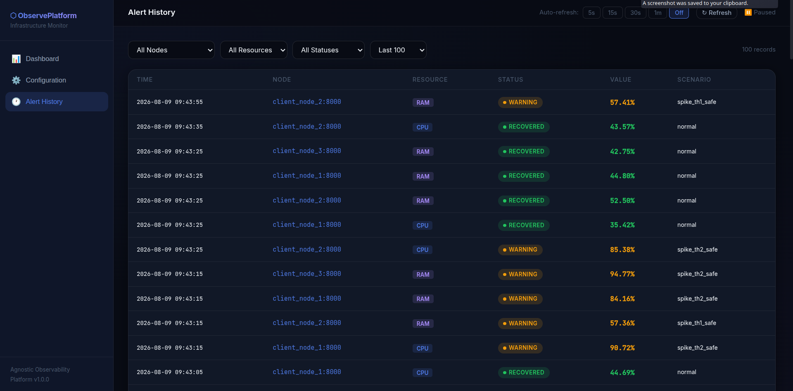
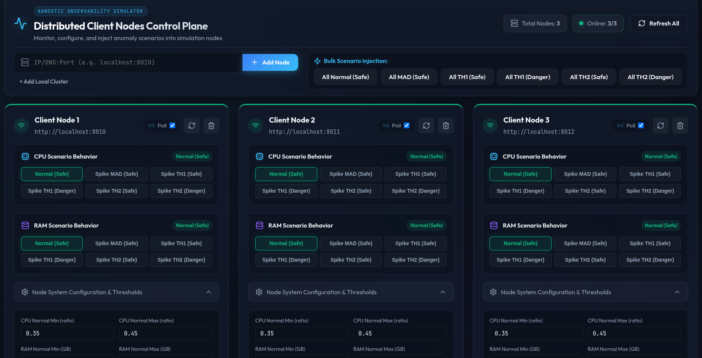

# Agnostic Observability Platform

---

<div align="center">

**A lightweight, platform-agnostic observability system for distributed infrastructures — featuring dynamic target management, real-time resource monitoring, multi-strategy anomaly detection, and multi-channel alerting.**

---

[](https://www.python.org/)
[](https://fastapi.tiangolo.com/)
[](https://react.dev/)
[](https://www.typescriptlang.org/)
[](https://prometheus.io/)
[](https://www.postgresql.org/)
[](https://www.docker.com/)

[Project Overview](#-project-overview) •
[System Architecture](#-system-architecture) •
[Tech Stack](#-tech-stack) •
[Quick Start](#-quick-start) •
[Folder Structure](#-folder-structure) •
[Modules](#-shared-infrastructure) •
[Services](#-services)

</div>

---

## 📖 Project Overview

The **Agnostic Observability Platform** is a full-stack monitoring system designed to observe distributed nodes in a platform-independent way. Rather than depending on a specific cloud provider or runtime environment, it uses Prometheus for metric collection and wraps all intelligence — detection, alerting, and configuration — into a self-contained backend service.

The system is structured around three main concerns:

1. **Metric Collection** — Client nodes expose CPU and RAM metrics via a Prometheus-compatible `/metrics` endpoint. Prometheus scrapes them on a configurable interval using dynamic file-based service discovery (`targets.json`).
2. **Anomaly Detection** — The Core Backend runs a continuous background worker that pulls metrics from Prometheus every 10 seconds, evaluates them against two pluggable strategies (Threshold + MAD), and classifies each node's resource state.
3. **Alerting & Dashboard** — When a threshold violation is sustained long enough, the Alert Dispatcher fires notifications to configured channels (Telegram, Gmail, Webhook) and persists state changes to PostgreSQL for real-time dashboard rendering.

### Core Objectives

- **Platform-agnostic monitoring:** Any node that can expose a Prometheus `/metrics` endpoint can be observed.
- **Dynamic target management:** Add or remove monitored nodes at runtime without restarting Prometheus.
- **Dual-strategy anomaly detection:** Combine fixed-threshold analysis with statistical MAD scoring for robust detection.
- **Real-time dashboard:** A React frontend displays live node status, metric history charts, and alert logs.
- **Multi-channel alerting:** Deliver notifications via Telegram bot, Gmail SMTP, or any HTTP webhook.

---

## ✨ Platform Features

- **Background Anomaly Worker:** Runs as an async thread inside the FastAPI process, polling Prometheus every 10 seconds without blocking API requests.

- **Threshold Strategy:** Two configurable thresholds (Th1, Th2). Violations are tracked with a duration timer — only sustained anomalies escalate to a critical alert, preventing noise from transient spikes.

- **MAD Strategy (Median Absolute Deviation):** Fetches 5 minutes of historical data from Prometheus and computes a modified Z-score. Acts as a complementary signal to confirm anomalies detected near Th1.

- **Dynamic Prometheus Target Management:** `targets.json` is shared between the `core-backend` container and the `prometheus` container via a Docker volume. The API updates this file at runtime, causing Prometheus to hot-reload new scrape targets without restart.

- **Scenario-based Client Simulator:** Each simulated client node supports 6 controllable CPU/RAM scenarios (Normal, MAD Spike, Th1 Safe, Th1 Danger, Th2 Safe, Th2 Danger) to validate the full detection pipeline end-to-end.

- **Pluggable Notification Channels:** Telegram, Webhook, and Gmail are built-in. All channels are configured via the database and dispatched asynchronously in a background thread to avoid blocking the detection loop.

- **Alert History & Node Status Persistence:** PostgreSQL stores both real-time `node_current_status` (upserted every scrape cycle) and a historical `alert_history` table for audit and chart rendering.

---

## 🛠 Tech Stack

| Category | Technologies |
| :--- | :--- |
| **Backend Language** | Python 3.10+ |
| **Backend Framework** | FastAPI + Uvicorn |
| **Frontend** | React + TypeScript + Vite + Nginx |
| **Metrics Collection** | Prometheus (file-SD based dynamic targets) |
| **Database** | PostgreSQL 16 |
| **Anomaly Detection** | Threshold Strategy · MAD (Median Absolute Deviation) |
| **Alerting** | Telegram Bot API · Gmail SMTP · Generic Webhook |
| **Infrastructure** | Docker · Docker Compose |

---

## 🚀 Quick Start

### Prerequisites

- **OS:** Linux / macOS
- **Tools:** Docker & Docker Compose

### 1. Clone and configure environment

```bash
git clone <repo-url>
cd agnostic-observability-platform
cp .env.example .env
```

Edit `.env` with your secrets:

```env
POSTGRES_PASSWORD=your_password
```

### 2. Initialize the database schema

```bash
cp src/shared/postgres/init_db.example.sql src/shared/postgres/init_db.sql
```

Edit `init_db.sql` to set your notification channel credentials (Telegram bot token, Gmail credentials, etc.). The backend will apply the schema automatically on startup.

> The `init_db.sql` creates tables: `anomaly_strategies`, `alert_notifications`, `node_current_status`, `alert_history` — and seeds default strategy configs and notification channels.

### 3. Start the core infrastructure

```bash
docker compose -f docker_compose.yml up -d --build
```

This starts: **Core Backend** (FastAPI + Anomaly Worker on `:8000`), **Core Frontend** (React dashboard on `:80`), **Prometheus** (`:9090`), **PostgreSQL** (`:5432`).

> ⚠️ The `prom_shared_data` Docker volume is mounted to both `core-backend` and `prometheus` containers. This allows the backend to write updates to `targets.json` which Prometheus hot-reloads without restart.

### 4. Start the client simulators

```bash
cd src/simulator
docker compose -f docker_compose.yml up -d --build
```

This launches 3 simulated client nodes (ports 8010–8012) and the Client Control Plane UI (port 3000).

> The simulator stack joins the `agnostic-observability-platform_monitor-net` Docker network, which must already exist from step 3.


---


## 📂 Folder Structure

```text
agnostic-observability-platform/
├── docker/                         # External service configurations
│   ├── prometheus/
│   │   ├── prometheus.yml          # Prometheus scrape config (file-SD based)
│   │   └── targets.json            # Dynamic scrape targets (hot-reloaded)
│   └── alertmanager/
│       └── alertmanager.yml        # Alertmanager config (reserved)
├── local/                          # Local dev utilities
├── outputs/                        # Generated outputs / logs
├── src/
│   ├── config/                     # Shared app configuration loader
│   │   ├── config.dev.yml          # Dev environment config
│   │   ├── config.prod.yml         # Production config
│   │   ├── settings.py             # YAML + .env config loader
│   │   └── logging.py              # Logging setup
│   ├── shared/                     # Shared infrastructure clients
│   │   ├── postgres/               # PostgresClient + DB schema SQL
│   │   └── prometheus/             # PrometheusClient (instant + range)
│   ├── core_backend/               # Core monitoring backend (FastAPI)
│   │   ├── api/                    # REST API routers
│   │   ├── anomaly_detection/      # Background worker + strategies
│   │   ├── alert_notification/     # Dispatcher + channel implementations
│   │   ├── config_management/      # Strategy/notification/target management
│   │   ├── core/                   # Shared enums and models
│   │   ├── main.py                 # FastAPI entrypoint + lifespan hooks
│   │   ├── Dockerfile
│   │   └── requirements.txt
│   ├── core_frontend/              # Monitoring dashboard (React + Nginx)
│   │   ├── dashboard_fe/           # Vite + React + TypeScript app
│   │   ├── Dockerfile
│   │   └── nginx.conf
│   └── simulator/                  # Client node simulators
│       ├── client-node/            # Simulated node (FastAPI + Prometheus metrics)
│       ├── client-control-plane/   # Control plane UI for managing simulators
│       └── docker_compose.yml      # Simulator stack compose file
├── docker_compose.yml              # Main infrastructure stack
├── .env.example                    # Environment variable template
└── .env                            # Secrets (not on Git)
```

---

## ⚙️ System Architecture

### High-Level Overview




---

## 📦 Modules

### Shared Infrastructure

* **Config module** reads the correct `config.<env>.yml` file based on `APP_ENV` and substitutes `${VAR}` placeholders from `.env`, providing a single `load_config()` call used by every service.
* **`PostgresClient`** is a thin SQLAlchemy wrapper exposing `execute_query` (SELECT → list of dicts) and `execute_non_query` (INSERT / UPDATE). Used by both the API layer and the anomaly worker.
* **`PrometheusClient`** wraps the Prometheus HTTP API with two methods — `query_instant` for the 10-second polling loop and `query_range` for the MAD strategy and dashboard chart history.

*See details:* [Config & Shared Infrastructure](./src/config/README.md)

### 🧠 Core Backend

#### 1. Anomaly Detection Worker

* Launched as a background thread via `asyncio.to_thread()` on FastAPI startup — runs independently of API request handling.
* Every **10 seconds**, queries Prometheus for `client_cpu_usage_ratio` and `client_ram_usage_ratio` for all scraped nodes.
* Passes each metric to `AnomalyEngine`, which runs both the **Threshold Strategy** and the **MAD Strategy** and returns a classified result (`normal`, `warning`, `alert`, `recovered`).

#### 2. Threshold Strategy

* Maintains an in-memory tracker per `node_id × resource_type`. On first breach of **Th1** or **Th2**, emits a `warning`.
* If the breach persists beyond `duration_danger_seconds` (default 30 s): escalates to `alert` for Th2, or for Th1 only when the MAD signal also confirms an anomaly.
* Notifications are throttled (warning: every 20 s, alert: every 30 s) to prevent flooding on the 10-second loop.

#### 3. MAD Strategy (Median Absolute Deviation)

* Fetches the last **5 minutes** of metric history from Prometheus via `query_range`.
* Computes a **modified Z-score** (`0.6745 × (value − median) / MAD`). If the score exceeds `mad_k` (default 3.0), the spike is statistically confirmed.
* Acts as a confirmation signal: upgrades a Th1 sustained warning to a critical alert only when the current value is a genuine statistical outlier vs. recent history.

#### 4. Alert Dispatcher

* On every alert / warning / recovery event: upserts `node_current_status` and appends to `alert_history` in PostgreSQL.
* Fetches enabled notification channels from the `alert_notifications` table and dispatches each via a **daemon thread** — Telegram Bot API, Gmail SMTP, or a generic HTTP Webhook.

*See details:* [Core Backend](./src/core_backend/README.md)

### 🖥️ Core Frontend

* A **React + TypeScript** single-page application built with Vite and served by Nginx inside Docker.
* Displays a real-time **Cluster Overview** — status cards per node, color-coded by alert level (🟢 / 🟡 / 🔴).
* Renders **time-series charts** for CPU and RAM by fetching historical data from Prometheus through the backend proxy (`/api/dashboard/metrics-history`).
* Includes a **Configuration Panel** to update anomaly strategy parameters, enable/disable notification channels, and manage Prometheus scrape targets — all without touching the database directly.

**Dashboard — Cluster Overview & Metric Charts**


**Configuration — Strategy, Notification & Target Management**


**Alert History — Dispatched Notification Log**


*See details:* [Core Frontend](./src/core_frontend/README.md)

### 🧪 Simulator

* **`client-node/`** — A FastAPI service that exposes Prometheus-compatible `/metrics` (CPU ratio, RAM bytes, RAM ratio) and accepts `POST /api/scenario/cpu|ram` to switch between 6 controlled simulation scenarios (Normal → Th2 Danger).
* Three simulator nodes run simultaneously (ports 8010–8012) on the same Docker network as the main stack, allowing Prometheus to scrape them immediately after target registration.
* **`client-control-plane/`** — A React UI to inject scenarios into any node via point-and-click, useful for demos and end-to-end validation.



*See details:* [Simulator](./src/simulator/README.md)

### 🐳 Docker Configs

* **`prometheus.yml`** configures Prometheus to use **file-based service discovery** (`file_sd_configs`) — Prometheus watches `targets.json` and hot-reloads scrape targets without restart.
* **`targets.json`** is mounted into both `prometheus` and `core-backend` containers via a shared named volume (`prom_shared_data`). The backend writes to it via `TargetsManager`; Prometheus reads it automatically.
* **`alertmanager/`** is reserved for future rule-based alerting via Prometheus Alertmanager.

*See details:* [Docker Configs](./docker/README.md)

---

## 🌐 Services

| Service | URL | Notes |
| :--- | :--- | :--- |
| **Core Backend API** | `http://localhost:8000` | FastAPI · Swagger at `/docs` |
| **Core Frontend Dashboard** | `http://localhost:80` | React monitoring dashboard |
| **Prometheus** | `http://localhost:9090` | Raw PromQL queries |
| **PostgreSQL** | `localhost:5432` | DB: `main_db` · user: `admin` |
| **Client Node 1** | `http://localhost:8010` | Simulator · `/metrics` · `/api/scenario/cpu` |
| **Client Node 2** | `http://localhost:8011` | Simulator · `/metrics` · `/api/scenario/cpu` |
| **Client Node 3** | `http://localhost:8012` | Simulator · `/metrics` · `/api/scenario/cpu` |
| **Client Control Plane** | `http://localhost:3000` | Simulator control UI |
