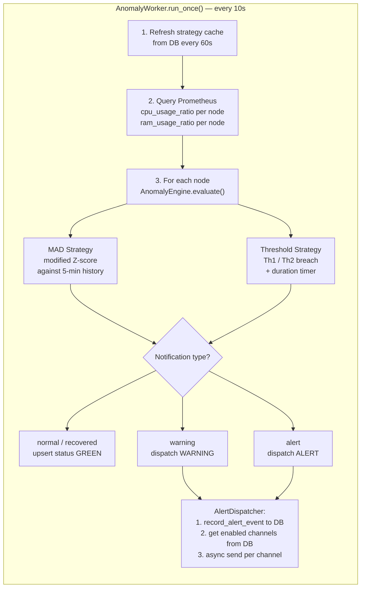

# 🧠 Core Backend

The Core Backend is the central brain of the platform. It is a **FastAPI** application that runs two parallel responsibilities:

1. **REST API** — Exposes endpoints for configuration management and dashboard data.
2. **Background Anomaly Worker** — A continuous loop (every 10 seconds) that fetches metrics from Prometheus, evaluates anomaly strategies, and fires alerts.

---

## 📁 Module Structure

```text
core_backend/
├── main.py                     # FastAPI entrypoint + lifespan hooks
├── Dockerfile
├── requirements.txt
├── api/
│   ├── monitoring_router.py    # GET endpoints for dashboard data
│   ├── config_management_router.py  # GET/PUT for strategies, notifications, targets
│   └── models.py               # Pydantic request body models
├── anomaly_detection/
│   ├── worker.py               # AnomalyWorker — main polling loop
│   ├── anomaly_engine.py       # AnomalyEngine — coordinates strategies
│   └── strategies/
│       ├── threshold_strategy.py   # Fixed Th1/Th2 with duration tracking
│       └── mad_strategy.py         # Median Absolute Deviation (statistical)
├── alert_notification/
│   ├── dispatcher.py           # AlertDispatcher — queries channels, dispatches async
│   ├── alert_history.py        # AlertHistoryService — persists status + history to DB
│   ├── channels.py             # TelegramChannel, WebhookChannel, GmailChannel
│   ├── factory.py              # NotificationFactory — creates channel by name
│   └── base.py                 # BaseNotificationChannel abstract class
├── config_management/
│   ├── service.py              # ConfigManagementService — DB CRUD
│   └── targets_manager.py      # TargetsManager — read/write targets.json
└── core/
    └── models.py               # CPUScenario, RAMScenario enums
```

---

## 🚀 Startup Flow

```python
# main.py — on startup (lifespan):
app_config = load_config()
db_client  = PostgresClient(app_config)
config_service  = ConfigManagementService(db_client)
anomaly_worker  = AnomalyWorker(config_service, app_config, interval_seconds=10)

# Launched in a background thread (non-blocking):
worker_task = asyncio.create_task(asyncio.to_thread(anomaly_worker.run))
```

The worker runs in a thread so it never blocks the async event loop. On shutdown, the task is cancelled and the DB connection is closed gracefully.

---

## 🔍 Anomaly Detection Pipeline

### AnomalyWorker (`anomaly_detection/worker.py`)

The `run()` method loops forever, calling `run_once()` every 10 seconds. Each cycle:

1. **Refresh strategy cache** — Re-reads strategy config from DB every 60 seconds (avoids per-loop DB hits).
2. **Query Prometheus** — Fetches current `cpu_usage_ratio` and `ram_usage_ratio` for all scraped nodes via `query_instant`.
3. **Per-node evaluation** — Calls `AnomalyEngine.evaluate_cpu()` and `evaluate_ram()` for each node result.
4. **Dispatch** — Based on the returned notification type, calls `AlertDispatcher.dispatch()` or upserts node status to "recovered".

### AnomalyEngine (`anomaly_detection/anomaly_engine.py`)

Coordinates the two strategies and resolves the final outcome:

```
value < Th1?
  ├─ Was previously tracked → emit "recovered"
  └─ Otherwise             → "normal" (no notification)

value ≥ Th1?
  ├─ Run MAD Strategy   (modified Z-score against 5-min history)
  └─ Run Threshold Strategy (Th1/Th2 + duration timer)
       └─ Returns: (scenario, notification_type, is_danger)
```

#### Detection Loop Flow



#### Detection Outcome Table

| Value Range | Sustained Duration | MAD Triggered | Outcome |
| :--- | :--- | :--- | :--- |
| `value < Th1` | — | — | **Normal / Recovered** (green) |
| `Th1 ≤ value < Th2` | first breach | — | **Warning** (yellow) |
| `Th1 ≤ value < Th2` | ≥ 30 s | ✅ Yes | **Alert** — Th1 Danger (red) |
| `Th1 ≤ value < Th2` | ≥ 30 s | ❌ No | **Warning** (sustained, yellow) |
| `value ≥ Th2` | first breach | — | **Warning** (yellow) |
| `value ≥ Th2` | ≥ 30 s | — | **Alert** — Th2 Danger (red) |

> Default: `Th1 = 0.55`, `Th2 = 0.75`. Tunable at runtime via `/api/config/strategies`.

### Threshold Strategy (`anomaly_detection/strategies/threshold_strategy.py`)

Uses two configurable thresholds and a **duration-based escalation** model:

| Condition | Duration | Outcome |
| :--- | :--- | :--- |
| `value ≥ Th1` — first breach | — | **warning** · start timer |
| `value ≥ Th1` — sustained | `< 30 s` | **warning** (re-emit every 20 s) |
| `value ≥ Th1` — sustained + MAD confirmed | `≥ 30 s` | **alert** — Th1 Danger (every 30 s) |
| `value ≥ Th1` — sustained, no MAD | `≥ 30 s` | **warning** (sustained) |
| `value ≥ Th2` — first breach | — | **warning** · start timer |
| `value ≥ Th2` — sustained | `≥ 30 s` | **alert** — Th2 Danger (every 30 s) |

> The throttle intervals prevent duplicate notifications on every 10-second loop.

### MAD Strategy (`anomaly_detection/strategies/mad_strategy.py`)

Fetches the last **5 minutes** of metric history from Prometheus and computes:

```
median           = median(history_values)
MAD              = median(|v - median|  for v in history_values)
modified_z_score = 0.6745 × (current_value - median) / MAD

is_anomaly = |modified_z_score| > mad_k      (default: mad_k = 3.0)
```

MAD acts as a *confirmation* signal: it upgrades a Th1 sustained warning into a full **alert** when statistical deviation is also significant.

---

## 📣 Alert Notification Pipeline

### AlertDispatcher (`alert_notification/dispatcher.py`)

Called by the Worker after each evaluation:

1. **Record event** — Calls `AlertHistoryService.record_alert_event()` to upsert `node_current_status` and append to `alert_history`.
2. **Fetch enabled channels** — Queries `alert_notifications WHERE is_enabled = TRUE` from DB.
3. **Async dispatch** — Spawns a daemon `threading.Thread` per alert to avoid blocking the 10-second detection loop.

### Notification Channels (`alert_notification/channels.py`)

| Channel | Transport | Config fields in DB |
| :--- | :--- | :--- |
| `TelegramChannel` | Telegram Bot API (`sendMessage`) | `bot_token`, `chat_id` |
| `WebhookChannel` | HTTP POST with JSON payload | `url` |
| `GmailChannel` | SMTP via `smtplib` + STARTTLS | `smtp_server`, `port`, `sender_email`, `password`, `recipient_email` |

All channels receive: `node_id`, `resource_type`, `value`, `scenario`, `alert_level` (`warning` / `alert` / `recovered`).

---

## 🌐 REST API Endpoints

### Configuration (`/api/config`)

| Method | Path | Description |
| :--- | :--- | :--- |
| `GET` | `/api/config/strategies` | List all anomaly detection strategies |
| `PUT` | `/api/config/strategies/{id}` | Update strategy params and enable/disable |
| `GET` | `/api/config/notifications` | List all notification channels |
| `PUT` | `/api/config/notifications/{channel_name}` | Update channel params and enable/disable |
| `GET` | `/api/config/targets` | Get current Prometheus scrape targets |
| `PUT` | `/api/config/targets` | Overwrite Prometheus targets (hot-reload) |

### Dashboard (`/api/dashboard`)

| Method | Path | Description |
| :--- | :--- | :--- |
| `GET` | `/api/dashboard/nodes-realtime-status` | All nodes' current CPU/RAM status |
| `GET` | `/api/dashboard/node-status?node_id=` | Single node's latest status |
| `GET` | `/api/dashboard/alert-history?limit=` | Historical alert log |
| `GET` | `/api/dashboard/metrics-history?node_id=&metric_type=&minutes=` | Time-series from Prometheus for chart rendering |

---

## 💻 Running Locally

```bash
pip install -r requirements.txt
uvicorn src.core_backend.main:app --host 0.0.0.0 --port 8000 --reload
```

Swagger UI available at `http://localhost:8000/docs`
